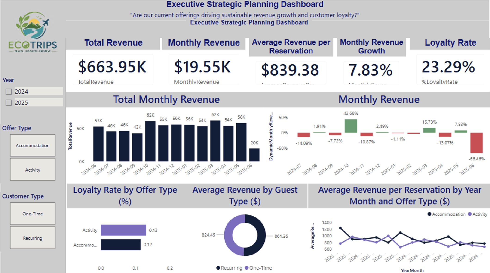
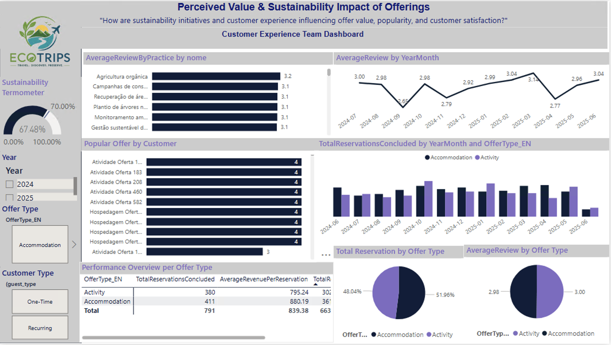
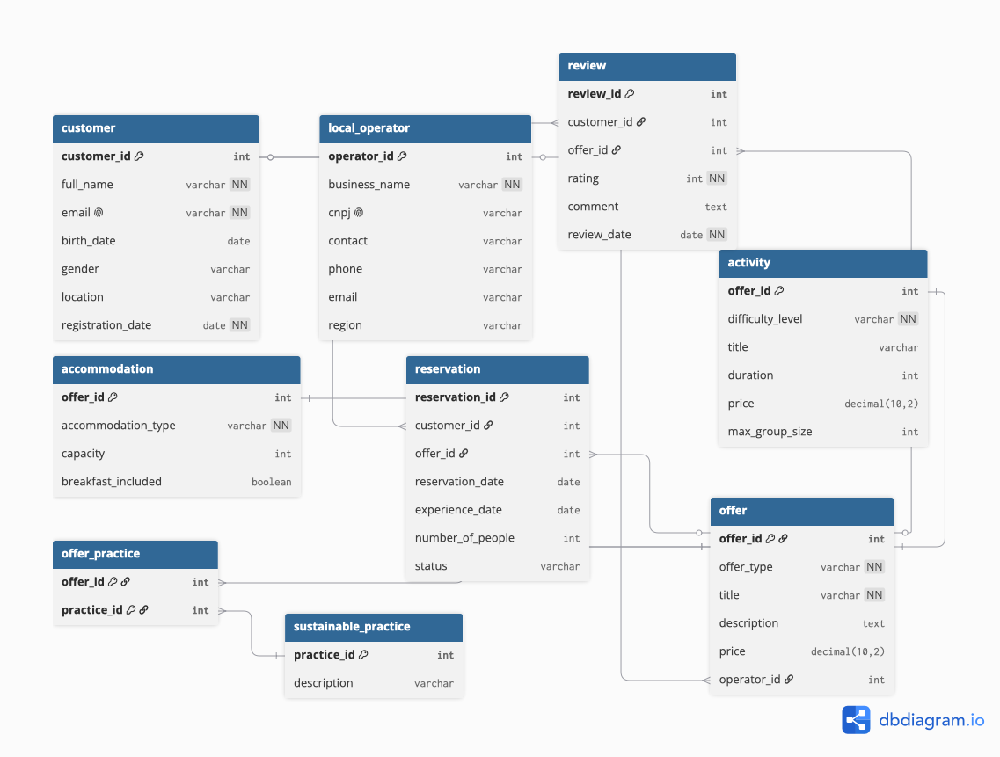

# 🌍 EcoTrips Business Intelligence Project

A Business Intelligence solution developed to transform operational travel data into actionable insights through SQL analysis, interactive dashboards, and business-focused reporting.


---

# 📖 Project Overview

EcoTrips is a Business Intelligence project that analyzes customer behavior, reservation trends, revenue performance, and sustainability initiatives for a travel company.

The project demonstrates a complete Business Intelligence workflow—from relational data modeling and SQL analysis in Google BigQuery to KPI development and interactive Power BI dashboards—supporting data-driven business decisions.

---

# 📌 Executive Summary

The objective of this project was to transform operational travel data into meaningful business insights that support strategic decision-making.

By integrating relational data modeling, SQL analysis, KPI development, and interactive dashboards, the solution enables stakeholders to monitor business performance, evaluate customer behavior, measure sustainability initiatives, and track key performance indicators (KPIs).

### Project Deliverables

- Relational data model (DBML)
- SQL analysis using Google BigQuery
- Business KPI calculations
- Interactive Power BI dashboards
- Executive presentation
- Project documentation

---

# 🎯 Business Problem

The project addresses business questions such as:

- Which travel offers generate the highest revenue?
- How has monthly revenue evolved over time?
- What is the customer loyalty rate?
- How much does each customer spend on average?
- Which travel offers receive the highest customer ratings?
- Which sustainability initiatives are most adopted?
- How long does it take customers to make another reservation?

---

# 🛠 Tech Stack

| Technology | Purpose |
|------------|----------|
| Google BigQuery | Data storage and SQL querying |
| Microsoft Power BI | Interactive dashboard development |
| DAX | KPI and measure calculations |
| Power Query | Data transformation and preparation |
| DBML | Relational data modeling |

---

# 📊 Key Performance Indicators

The dashboard includes the following business metrics:

- Total Revenue
- Monthly Revenue Growth
- Average Customer Spending
- Customer Loyalty Rate
- Average Offer Rating
- Median Offer Price
- Average Repurchase Time
- Sustainability Index

---

# 📈 Dashboard Preview

### Executive Dashboard



### Sustainability Dashboard



---

# 🏗 Project Workflow

```text
Raw Data
     │
     ▼
Google BigQuery
     │
     ▼
SQL Analysis
     │
     ▼
KPI Development
     │
     ▼
Power BI Dashboard
     │
     ▼
Business Insights
```

---

# 🗄️ Data Model

The relational database was designed to support analytical queries, KPI calculations, and interactive Power BI dashboards.

The model connects customers, reservations, travel offers, and sustainability initiatives through well-defined relationships that enable efficient business analysis.



For additional details, including entity descriptions and relationship explanations, see the **01_Data_Model** folder.

---

# 📁 Repository Structure

```text
EcoTrips-Business-Intelligence
│
├── README.md
├── LICENSE
├── .gitignore
├── 01_Data_Model
├── 02_SQL
├── 03_PowerBI
├── 04_Presentation
├── 05_Dashboard_Images
└── 06_Documentation
```

---

# 💡 Business Value

The project demonstrates how Business Intelligence transforms operational data into actionable insights by:

- Monitoring revenue performance over time.
- Understanding customer purchasing behavior.
- Measuring customer loyalty and repurchase patterns.
- Evaluating sustainability initiatives.
- Supporting strategic decision-making through executive dashboards and KPIs.

---

# 🚀 Getting Started

1. Review the relational data model in **01_Data_Model**.
2. Explore the SQL scripts available in **02_SQL**.
3. Open the Power BI report located in **03_PowerBI**.
4. Review the presentation and supporting documentation for additional business context.

---

# 📚 Documentation

Additional documentation is available in the **06_Documentation** folder, including:

- Executive Summary
- Project Overview
- Business Questions
- Data Dictionary

---

# 👩‍💼 Author

**Salmah Menelik**

MBA | Business Analyst | Data Analytics | Business Intelligence

**LinkedIn:** https://www.linkedin.com/in/salmah-menelik/

---

⭐ Thank you for visiting this project! Feel free to explore the repository and discover how Business Intelligence techniques can transform operational data into actionable business insights.