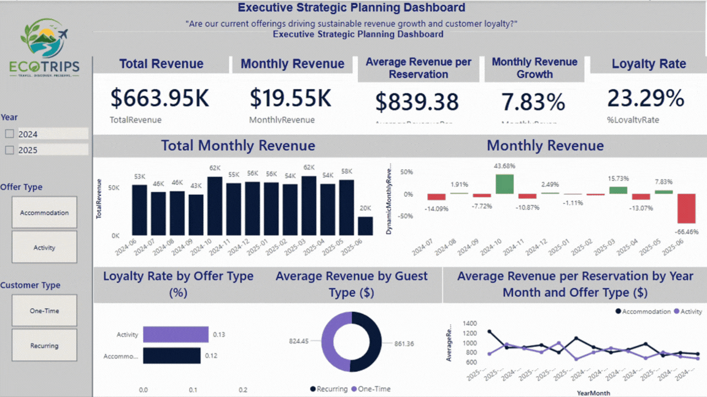

# 🌍 EcoTrips | End-to-End Business Intelligence Project

End-to-end Business Intelligence project using Google BigQuery, SQL, Power BI, DAX and relational data modeling to transform operational travel data into strategic business insights.

<p align="center">
  
  
  
  
  
</p>

---

<p align="center">
  
</p>

<p align="center">
<i>Interactive dashboard preview</i>
</p>

---

# 📖 Project Overview

EcoTrips is a Business Intelligence case study developed to analyze customer behavior, reservation trends, revenue performance, and sustainability initiatives for a travel company.

The project demonstrates a complete analytics workflow—from relational database design and SQL analysis in Google BigQuery to KPI development and interactive Power BI dashboards—turning raw operational data into actionable business insights.

---

# 🎯 Business Problem

Travel companies collect large volumes of operational data but often struggle to transform it into actionable insights for decision-making.

This project addresses questions such as:

- Which travel offers generate the highest revenue?
- How has revenue evolved over time?
- Which customer segments are the most valuable?
- How effective are sustainability initiatives?
- What factors influence customer loyalty?
- Which offers receive the highest ratings?
- How can business performance be monitored through executive dashboards?

---

# 🏗 Solution Overview

The project follows a complete Business Intelligence workflow:

```text
Operational Data
        │
        ▼
 Relational Data Modeling (DBML)
        │
        ▼
 Google BigQuery
        │
        ▼
 SQL Business Analysis
        │
        ▼
 KPI Development
        │
        ▼
 Power BI Dashboards
        │
        ▼
 Business Insights & Strategic Recommendations
```

---

# 📈 Key Insights

The analysis uncovered several actionable business insights:

- 💰 Accommodation packages generated the highest overall revenue.
- 🔄 Activity packages showed a higher proportion of repeat customers.
- 📈 Revenue peaked during late 2024 before declining in mid-2025.
- 🌱 Sustainability initiatives positively influenced customer satisfaction.
- ⭐ Customer ratings remained consistently high across both offer categories.
- 📊 Customer loyalty reached approximately **23%**, highlighting opportunities for targeted retention strategies.

These findings demonstrate how Business Intelligence supports strategic planning, revenue optimization, customer retention, and sustainability initiatives.

---

# 📊 Dashboard Preview

## Executive Strategic Planning Dashboard

<p align="center">

</p>

---

## Sustainability Impact Dashboard

<p align="center">

</p>

---

# 📊 Key Performance Indicators

The dashboards monitor several business KPIs, including:

- Total Revenue
- Monthly Revenue
- Monthly Revenue Growth
- Average Revenue per Reservation
- Customer Loyalty Rate
- Average Customer Spending
- Median Offer Price
- Average Offer Rating
- Average Repurchase Time
- Sustainability Index

---

# 🛠 Tech Stack

| Technology | Purpose |
|------------|----------|
| Google BigQuery | Cloud data warehouse and SQL analysis |
| Microsoft Power BI | Dashboard development and visualization |
| DAX | KPI and measure calculations |
| Power Query | Data transformation |
| DBML | Relational database modeling |

---

# 🗄 Data Model

The relational database was designed to support analytical queries, KPI calculations, and dashboard reporting.

It integrates customers, reservations, travel offers, and sustainability initiatives into a normalized analytical model.

<p align="center">

</p>

Additional documentation is available in the **01_Data_Model** folder.

---

# 📂 Repository Structure

```text
EcoTrips-Business-Intelligence
│
├── README.md
├── LICENSE
├── .gitignore
│
├── 01_Data_Model
│   ├── EcoTrips.dbml
│   ├── EcoTrips_Data_Model.pdf
│   └── EcoTrips_Data_Model.png
│
├── 02_SQL
│   ├── 01_data_exploration.sql
│   ├── 02_business_queries.sql
│   └── 03_kpi_calculations.sql
│
├── 03_PowerBI
│   ├── EcoTrips.pbix
│   └── EcoTrips_Dashboard.pdf
│
├── 04_Presentation
│   ├── EcoTrips_Presentation.pdf
│   └── EcoTrips_Presentation.pptx
│
├── 05_Dashboard_Images
│   ├── Executive_Dashboard.png
│   └── Sustainability_Dashboard.png
│
└── 06_Documentation
    ├── Project_Overview.md
    ├── Business_Questions.md
    └── Data_Dictionary.md
```

---

# 💡 Business Value

The solution demonstrates how Business Intelligence can transform operational data into measurable business value by:

- Monitoring revenue performance
- Identifying customer purchasing behavior
- Measuring customer loyalty
- Tracking sustainability initiatives
- Supporting executive decision-making
- Enabling KPI-driven performance management

---

# 🚀 Getting Started

### 1. Explore the Data Model

Navigate to **01_Data_Model** to understand the relational schema.

### 2. Review SQL Analyses

Open **02_SQL** to explore business queries and KPI calculations.

### 3. Open the Dashboard

Launch the Power BI report located in **03_PowerBI**.

### 4. Review the Presentation

The executive presentation summarizes methodology, findings, and business recommendations.

---

# 📚 Documentation

Additional project documentation is available in the **06_Documentation** folder, including:

- Project Overview
- Business Questions
- Data Dictionary

---

# 👩‍💼 Author

**Salmah Menelik**

MBA | Business Analyst | Business Intelligence | Data Analytics

📍 United States

**LinkedIn**

https://www.linkedin.com/in/salmah-menelik/

---

## ⭐ If you found this project interesting...

Feel free to explore the repository, review the SQL analyses, interact with the Power BI dashboards, and connect with me on LinkedIn.

Feedback and suggestions are always welcome.